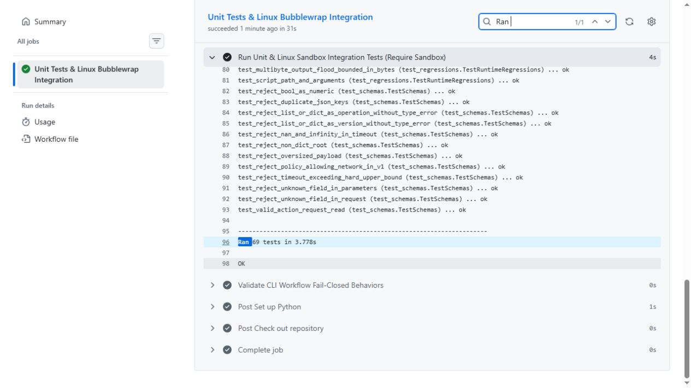
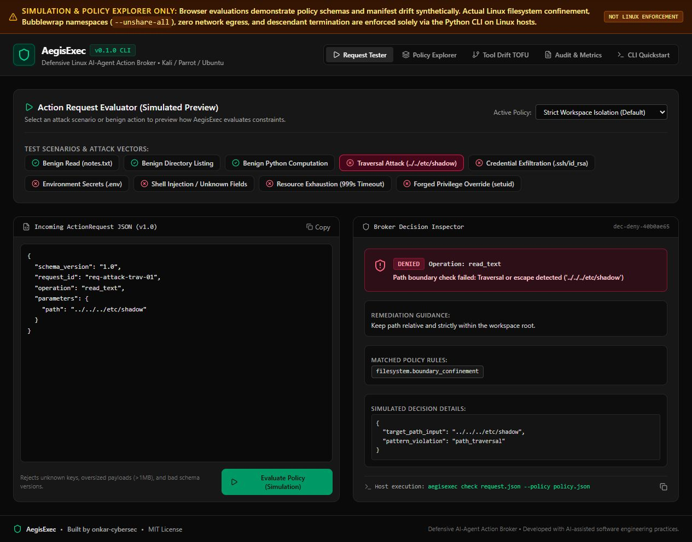

# AegisExec

**Defensive Linux AI-agent action broker — Built by onkar-cybersec**

AegisExec mediates structured requests from an untrusted AI agent before it can read workspace files or run Python. It is an experimental security project, not a general AI attack detector. The Python CLI enforces the controls; the optional browser interface is a **simulation**, not a running Linux sandbox.

## Five defensive controls

| Control | What it does |
| --- | --- |
| Workspace boundaries | Rejects absolute paths, raw `..`, symlinks, hardlink aliases, special files and common credential filenames. Opens each path component relative to a trusted directory descriptor. |
| Network isolation | Runs Python inside a Bubblewrap network namespace without host interfaces or outbound connectivity. |
| Restricted action interface | Accepts only `read_text`, `list_dir` and `run_python`. No arbitrary host shell or executable request. Python may launch installed runtime binaries **inside** its sandbox. |
| Execution limits | Drops Linux capabilities, uses a read-only workspace snapshot, bounds output bytes and wall time, and sets worker resource limits. Missing sandbox prerequisites fail closed. |
| Manifest drift review | Compares canonical SHA-256 tool descriptions and capabilities against an operator-pinned baseline. Pinning is trust-on-first-use; it neither executes tools nor proves their safety. |

Auditing uses a metadata allowlist, hashes request identifiers and excludes raw code, paths, file contents and approval tokens. JSON and escaped HTML reports summarize decisions. Approval-required operations fail closed in v0.1; supplying a token does not authorize them.

## Install on Linux

Designed for Kali, Parrot, Debian and Ubuntu. Actual integration testing uses Ubuntu 22.04 with Python 3.10 and distro Bubblewrap. Your kernel must permit the required unprivileged namespaces. Run as an ordinary user; do not disable host security protections to make the diagnostic pass.

```bash
sudo apt update
sudo apt install -y python3 python3-venv bubblewrap
git clone https://github.com/onkar-cybersec/AegisExec.git
cd AegisExec
python3 -m venv .venv
source .venv/bin/activate
python -m pip install -e .
aegisexec doctor
```

The broker trusts `/usr/bin/bwrap` and uses `/usr/bin/python3` inside the sandbox. Windows and macOS cannot execute its Linux sandbox.

## Try it

Initialize a **new or empty** directory. Generated policy paths match your machine.

```bash
aegisexec init --dir ./demo
aegisexec check demo/requests/valid_read.json --policy demo/policy.json
aegisexec run demo/requests/valid_read.json --policy demo/policy.json
# This traversal request must be denied (exit status 2):
aegisexec run demo/requests/attack_traversal.json --policy demo/policy.json

aegisexec verify demo/tools.json --baseline demo/baseline.json
aegisexec report demo/audit.jsonl --format html --output demo/report.html
```

Create a calculation request:

```bash
cat > demo/requests/calc.json <<'JSON'
{"schema_version":"1.0","request_id":"calc-1","operation":"run_python","parameters":{"code":"print(sum(range(10)))"}}
JSON
aegisexec run demo/requests/calc.json --policy demo/policy.json
```

Exit statuses: `0` success, `2` denied/not executed, `3` manifest drift, `4` worker nonzero exit or limit exceeded. `check` evaluates policy; it does not run code or certify sandbox availability. Run `doctor` before execution.

To integrate an agent, route its requested operations through `AegisBroker.check()` / `AegisBroker.run()` using your trusted policy. The manifest comparison is a separate operator review command; `run` does not automatically require a pinned manifest.

## Tests

```bash
python -m unittest discover -s tests -v
# Linux CI must exercise the sandbox instead of skipping it:
REQUIRE_SANDBOX=1 python -m unittest discover -s tests -v
```

The suite covers schema and quota rejection, traversal, symlink swaps, hardlinks, credential names, nested workspace allowlists, audit privacy, report escaping, manifest drift, outside-file access, network denial, read-only mounts, output flooding, timeouts and actual detached-child cleanup. GitHub Actions additionally exercises the CLI workflow. Linux integration tests are skipped on unsupported local systems unless `REQUIRE_SANDBOX=1` is set.

[View test runs](https://github.com/onkar-cybersec/AegisExec/actions)

**Verified:** 69 tests passed with no skips in mandatory Linux CI, including 17 sandbox execution tests; the CLI smoke workflow also passed. [Reviewed source test run](https://github.com/onkar-cybersec/AegisExec/actions/runs/37754508256).



## Optional policy explorer

The React interface uses synthetic examples and makes **simulated** policy decisions. It does not call a model, execute Python, or enforce a host sandbox. Its checks are illustrative; use the CLI as the authoritative implementation. No AI API key is required.

```bash
pnpm install --frozen-lockfile
pnpm run dev
# Typecheck and production bundle:
pnpm run lint
pnpm run build
```



## Trust boundaries and limitations

- Protection applies only to actions routed through this broker. An agent with direct host execution can bypass it.
- Use a dedicated workspace containing only data safe to share with untrusted code. Filename filters cannot recognize every secret. Source snapshot copying is bounded to 50 MiB, 2,000 entries and depth 16; it rejects admitted symlinks and special files.
- The sandbox exposes read-only system runtime directories. Installed binaries and readable runtime files remain accessible inside it. No seccomp allowlist is provided.
- Limits include per-process memory/CPU, per-file output size, open descriptors and a per-user process limit. They are not cgroup aggregate memory, process or temporary-disk budgets. Use an additional VM/container boundary for strongly hostile workloads.
- The Linux kernel, Bubblewrap, interpreter, broker files, policy, manifest baseline and audit directory are trusted. This does not defend against host-kernel vulnerabilities or a privileged attacker replacing those components.
- Reports refuse oversized individual records or total byte budgets; directory views are bounded and may omit entries beyond their limits. Snapshot preparation is bounded by entries/bytes but has no separate wall-time deadline.
- Manifest drift signals need human review. An unchanged manifest can still describe a malicious tool, and prompt injection is not reliably detectable through hashes.

## Project layout

`aegisexec/` contains the CLI, schema/policy engine, descriptor-based filesystem layer, Bubblewrap executor, worker, audit and manifest/report utilities. `tests/` contains unit and Linux integration tests. `src/` contains the educational policy explorer. `.github/workflows/ci.yml` runs Linux validation.

MIT licensed. Built with AI assistance and independently reviewed and tested; no production-security certification is implied.
